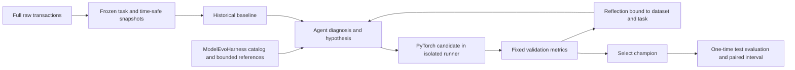

# LTVEvo

**An Agent-led experiment loop for predicting future customer value.** LTVEvo turns a fixed transaction dataset into a reproducible research task: the Agent reads prior results for that exact dataset, diagnoses errors, proposes a model hypothesis, writes PyTorch candidate code, runs a frozen evaluation, and records what it learned. The test set stays sealed until a final model is selected.

[简体中文](README.zh-CN.md)

## What problem it solves

An LTV model is useful only if its target, observation time, and evaluation are unambiguous. LTVEvo starts with a precise target: **the amount a known customer will purchase in the next H days**, measured from a historical observation date. It also reports how well the model ranks customers by that amount. The first public-data adapter uses the complete [UCI Online Retail II](https://archive.ics.uci.edu/dataset/502/online%2Bretail%2Bii) transaction data.

The Retail II target is positive purchase amount **before refunds**, not net revenue or margin. A fixed 90-day amount is an observed-horizon proxy for customer value, not a claim about the customer's entire remaining lifetime. LTVEvo does not estimate whether a coupon, message, or other action *causes* that value to change; those are different experiments.

## Experiment design



The task manifest freezes the raw-data SHA-256, horizon, target definition, observation dates, purged chronological splits, seed, primary metric, and evaluator version. Features are computed strictly before each observation date. Each label uses the complete future window. The Agent can change features inside its model and its PyTorch training code, but cannot change the task contract. A changed dataset or task receives a new experience identity.

The self-improving part is the **experiment process**: model code and hypotheses can change after measured feedback, while the evaluator and data contract stay fixed. The Agent's own weights are not trained by this project. Experience is reusable only when the raw dataset hash and task definition match.

In `--harness model-evo` mode, the pinned [ModelEvoHarness](https://github.com/CharlesXu-HQ/ModelEvoHarness) submodule supplies research-family applicability, bounded PyTorch reference reading, and validation of each hypothesis and reflection. LTVEvo supplies a local `ltv_prediction` family because the upstream catalog has no LTV regression family. LTVEvo continues to own the Agent provider, frozen data, GPU sandbox, metrics, journal, exact-dataset experience, and final holdout, following the host/harness boundary used by [CouponEvo](https://github.com/CharlesXu-HQ/CouponEvo). A ready research family describes an experiment direction; it is not evidence that a model improves MAE. The submodule commit and catalog/implementation hashes become part of the run identity, so changing them starts a new experiment.

**Selection uses validation MAE.** Reports also include RMSE, normalized Gini, top-decile value capture, decile calibration, and a paired customer-cluster bootstrap interval against the historical baseline. The interval describes uncertainty in the *offline prediction difference*; it is not an estimate of marketing lift. A final test result is produced once, after selection.

## Status and boundaries

The first release focuses on fixed-horizon value regression and high-value ranking. Reference candidates include an all-zero predictor, a historical-spend baseline, and a PyTorch MLP. The all-zero reference matters when most future windows have no purchase: a model must beat that simple MAE benchmark before claiming useful amount prediction. Agent-generated candidates use an OpenAI-compatible provider URL, API key, and model name. Normal iteration and report analysis request reasoning effort `high`; suspicious leakage or anomalous metrics are reviewed with `max`. GPU runs require CUDA rather than silently falling back to CPU.

The code and experiment artifacts are reproducible; public datasets are downloaded separately and are not redistributed under this repository's Apache-2.0 license. The UCI source page states its dataset license as CC BY 4.0. CUDA candidates must return predictions as a CUDA tensor; this records GPU prediction but cannot prove every training operation ran there. See [the task contract](docs/specs/2026-10-04-ltv-agent.md) and [implementation plan](docs/plans/2026-10-04-mvp.md) for the precise first-release scope.

**Measured result:** On full Online Retail II, an Agent candidate reduced validation MAE but did not improve the independent test MAE over the historical baseline. Adding the all-zero reference exposed strong temporal drift and a weak selection rule for this zero-heavy target. The exact rows, hashes, CUDA evidence, intervals, and limitations are in the [GPU experiment record](docs/benchmarks/online-retail-ii-gpu-2026-10-04.md). No positive model-improvement claim is made from this run.

## Run an experiment

1. Clone this repository with its pinned submodule: `git clone --recurse-submodules https://github.com/CharlesXu-HQ/LTVEvo.git`, then enter `LTVEvo`.
2. Download the **complete** UCI Online Retail II archive to your experiment machine from the [UCI source](https://archive.ics.uci.edu/dataset/502/online%2Bretail%2Bii). Keep the raw archive outside Git.
3. Copy [`examples/online-retail-ii-task.json`](examples/online-retail-ii-task.json) to `task.local.json`. Set `raw_path` to the archive's absolute path and replace the zero SHA-256 with the archive's actual hash. Keep the test split fixed during search.
4. Install and run with Python 3.12:

```bash
python -m venv .venv
. .venv/bin/activate
pip install -e .
pip install -e ./third_party/model-evo-harness
ltvevo prepare --task task.local.json --output data/snapshots/retail-90d
ltvevo baseline --task task.local.json --snapshots data/snapshots/retail-90d \
  --journal runs/retail-90d/journal.json --device cuda --harness model-evo
```

For Agent iteration, set `LTVEVO_API_KEY` and pass your provider URL and model to `ltvevo search`. The candidate runner needs a Docker image built from `Dockerfile.sandbox` with NVIDIA container access for `--device cuda`. `ltvevo finalize` evaluates the selected candidate on the sealed test split. The CLI help lists all options.

```bash
docker build -f Dockerfile.sandbox -t ltvevo-sandbox .
ltvevo search --task task.local.json --snapshots data/snapshots/retail-90d \
  --journal runs/retail-90d/journal.json --steps 3 --device cuda --harness model-evo \
  --provider-url https://api.deepseek.com --model YOUR_MODEL
ltvevo finalize --journal runs/retail-90d/journal.json --snapshots data/snapshots/retail-90d \
  --device cuda --provider-url https://api.deepseek.com --model YOUR_MODEL
```

Choose the Harness mode when creating a run; resume and finalization infer it from the journal. The base mode remains available for reading or continuing older journals. Harness mode requires Python 3.12 and its separately installed submodule. See [the adapter contract](docs/specs/2026-10-06-model-evo-harness-alignment.md) for the research and provenance boundary.

Provider payloads can be adjusted with `--thinking enabled|disabled|omit`. Use `--omit-reasoning-effort` only when a provider rejects that field; in that case the configured `high`/`max` levels remain local routing labels and the provider may not honor them. The API key is read only from `LTVEVO_API_KEY`.

## Contributing

Start with a failing test for a changed task or metric contract. Include the raw dataset's source, license, and SHA-256 in any reproducible result. Never submit API keys, raw transaction data, or an Agent claim of causal marketing impact based only on these prediction labels.

Licensed under Apache-2.0; see [LICENSE](LICENSE).
