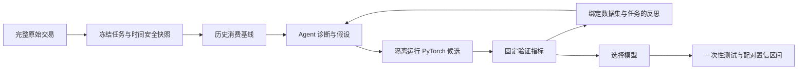

# LTVEvo

**让 Agent 主导用户未来价值预测实验。** LTVEvo 将固定交易数据集变成可复现的研究任务：Agent 读取该数据集与任务的历史结果，分析误差，提出可检验的模型假设，编写 PyTorch 候选代码，在冻结的验证集上运行，并记录实验结论。最终测试集在选出模型前不参与搜索。

[English](README.md)

## 解决什么问题

LTV 模型首先要说清楚标签、观察时点与评估方式。第一版预测**已知用户在观察日后 H 天的购买金额**，同时衡量高价值用户排序。公开数据适配器使用完整的 [UCI Online Retail II](https://archive.ics.uci.edu/dataset/502/online%2Bretail%2Bii) 交易数据，不抽样。

Retail II 的金额口径是**退款前的正向购买额**，不是净收入或毛利。固定 90 天购买额只是用户价值的可观测期限代理，也不代表完整生命周期价值。本项目不推断发券、推送或触达使价值增加多少；那需要干预效果实验。

## 实验设计



任务清单冻结原始数据 SHA-256、预测期限、标签口径、观察日期、留出间隔、随机种子、主指标和评估器版本。特征严格取观察日之前的信息；标签必须有完整未来观察窗口。Agent 可以修改模型内部特征处理和 PyTorch 训练代码，但不能改任务契约。数据集或任务定义变化后，经验身份也会变化。

这里自迭代的是**实验过程**：Agent 根据指标反馈修改假设与模型代码，评估器和数据契约保持固定。本项目不训练 Agent 自身的权重。只有原始数据哈希与任务定义一致时才复用经验。

**以验证集 MAE 选模型。** 报告同时给出 RMSE、normalized Gini、高预测值前 10% 用户捕获的实际价值、分层校准，以及相对历史消费基线的用户聚类配对 bootstrap 区间。这个区间衡量离线预测误差差异的不确定性，不是营销增量。选定模型后才做一次最终测试。

## 范围与状态

第一版只做固定期限金额回归和高价值排序。参考候选包括恒预测 0、历史消费基线与 PyTorch MLP。未来窗口没有购买的用户占多数时，恒预测 0 是必须超过的 MAE 门槛，不能只和较弱的历史模型比较就声称有效。Agent 模型通过兼容 OpenAI 的 provider URL、API key、模型名配置；常规迭代和报告分析使用 `high`，发现时间泄漏或指标异常时用 `max` 复核。要求 GPU 时，CUDA 不可用就报错，不自动回退到 CPU。

代码和实验记录可以公开，原始数据需自行下载，不会按项目的 Apache-2.0 许可再分发。UCI 数据源标明其许可证为 CC BY 4.0。CUDA 候选必须返回 CUDA 张量；这能记录 GPU 预测证据，但不能证明训练中的每个运算都在 GPU 上。完整边界见[任务契约](docs/specs/2026-10-04-ltv-agent.md)与[实施计划](docs/plans/2026-10-04-mvp.md)。

**实测结果：** 在全量 Online Retail II 上，Agent 候选降低了验证集 MAE，但独立测试集 MAE 未优于历史消费基线。加入恒预测 0 参考后，明显看出这个零值较多的任务存在时间漂移和模型选择风险。数据行数、哈希、CUDA 证据、区间与限制见 [GPU 实验记录](docs/benchmarks/online-retail-ii-gpu-2026-10-04.md)。本次实验不声称模型取得了可靠提升。

## 运行实验

1. 在实验机器上从 [UCI 页面](https://archive.ics.uci.edu/dataset/502/online%2Bretail%2Bii)下载**完整** Online Retail II 压缩包；不要提交原始数据到 Git。
2. 将 [`examples/online-retail-ii-task.json`](examples/online-retail-ii-task.json) 复制为 `task.local.json`，把 `raw_path` 改为压缩包的绝对路径，并用实际 SHA-256 替换全 0 占位值。搜索期间保持测试集切分不变。
3. 安装并准备数据：

```bash
python -m venv .venv
. .venv/bin/activate
pip install -e .
ltvevo prepare --task task.local.json --output data/snapshots/retail-90d
ltvevo baseline --task task.local.json --snapshots data/snapshots/retail-90d \
  --journal runs/retail-90d/journal.json --device cuda
```

设置 `LTVEVO_API_KEY` 后，用 `ltvevo search` 传入 provider URL 与模型名。候选隔离运行需要从 `Dockerfile.sandbox` 构建镜像；GPU 模式还需目标机具备 NVIDIA 容器支持。`ltvevo finalize` 只对选出的模型运行最终测试。参数可用 `ltvevo --help` 查看。

```bash
docker build -f Dockerfile.sandbox -t ltvevo-sandbox .
ltvevo search --task task.local.json --snapshots data/snapshots/retail-90d \
  --journal runs/retail-90d/journal.json --steps 3 --device cuda \
  --provider-url https://api.deepseek.com --model deepseek-flash
ltvevo finalize --journal runs/retail-90d/journal.json --snapshots data/snapshots/retail-90d \
  --device cuda --provider-url https://api.deepseek.com --model deepseek-flash
```

## 贡献

修改任务或指标契约时，请先添加失败用例。可复现实验必须说明原始数据来源、许可证与 SHA-256。不要提交 API key、原始交易数据，也不要把预测结果描述为营销触达的因果增量。

本项目采用 Apache-2.0；见 [LICENSE](LICENSE)。
